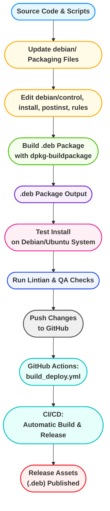

<p align="center">
  <br><br>
</p>

<p align="center">
  <br><br>
  <br><br>
  <code>HARDN-XDR</code>
</p>


<p align="center">
  
  
</p>


<br>
<br>
<p align="center">
  <br><br>
</p>


## HARDN-XDR
- **Our Goal**:
  - Assist the open source community in building a Debian based **"GOLDEN IMAGE"** System.
- **Our Purpose**:
  - To empower IT administrators and users with the tools they need to ensure endpoint security, optimize performance, and maintain compliance across their organization.
- **What we have to offer**:
  - A robust and secure endpoint management solution designed to simplify and enhance the management of devices in your network.
  - Advanced features for monitoring, securing, and maintaining endpoints efficiently.
  - `STIG` COMPLIANCE to align with the [Security Technical Information Guides](https://public.cyber.mil/stigs/) provided by the [DOD Cyber Exchange](https://public.cyber.mil/).


<br>
<br>
<p align="center">
  <br><br>
</p>

- **Comprehensive Monitoring**: Real-time insights into endpoint performance and activity.
- **Enhanced Security**: Protect endpoints with advanced security protocols.
- **Scalability**: Manage endpoints across small to large-scale networks.
- **User-Friendly Interface**: Intuitive design for seamless navigation and management.
- **STIG Compliance**: This release brings the utmost security for Debian Government based information systems.


<br>
<br>
<p align="center">
  <br><br>
</p>

There are two ways to install HARDN-XDR. The recommended method for most users is via the pre-built Debian package. The source installation is intended for developers or advanced users.

---

### Method 1: Install via Debian Package (Recommended for Users)

This method uses the latest stable release, packaged as a `.deb` file. It's the fastest and most reliable way to get started.

#### One-Command Install

Run the following command in your terminal. It will automatically download the latest release, install it, and handle all dependencies.

```bash
wget https://raw.githubusercontent.com/OpenSource-For-Freedom/HARDN-XDR/deb-package/install.sh
sudo chmod +x install.sh
sudo bash -x install.sh
```

### How to Run

Regardless of the installation method, you can start the hardening process by running:

```bash
sudo hardn start
```

<br>

### Installation Notes
- HARDN-XDR is currently being developed and tested for **BARE-METAL installs of Debian based distributions and Virtual Machines**.
- Ensure you have the latest version of **Debian 12** or **Ubuntu 24.04**.
- By installing HARDN-XDR with the commands listed in the installation process, the following changes will be made to your system:
> - A collection of security focused packages will be installed.
> - Security tools and services will be enabled.
> - System hardening and STIG settings will be applied.
> - A malware and signature detection and response system will be set up.
> - A monitoring and reporting system will be activated.
- For a detailed list of all that will be changed, please refer to [HARDN.md](docs/HARDN.md).
- For an overview of HARDN-Debian STIG Compliance, please refer to [deb_stig.md](docs/deb_stig.md).


<br>


## Actions
- [](https://github.com/OpenSource-For-Freedom/HARDN-XDR/actions/workflows/build_deploy.yml)
<br>

## Build Workflow: Debian Package



**Legend:**
- <span style="color:#1890ff"><b>Source</b></span>: Project code and scripts.
- <span style="color:#faad14"><b>Packaging</b></span>: Debian packaging files (`debian/`).
- <span style="color:#52c41a"><b>Build</b></span>: Building the `.deb` package.
- <span style="color:#722ed1"><b>Output</b></span>: Generated `.deb` file.
- <span style="color:#eb2f96"><b>Test</b></span>: Local install and verification.
- <span style="color:#2f54eb"><b>QA</b></span: Lintian and quality checks.
- <span style="color:#595959"><b>VCS</b></span>: Version control (GitHub).
- <span style="color:#13c2c2"><b>CI/CD</b></span>: Automated build and release.
- <span style="color:#f5222d"><b>Release</b></span>: Published assets for users.


## File Structure


```bash
HARDN-XDR/
├── .github/workflows/
│   └── build_deploy.yml
├── changelog.md
├── debian/
│   ├── control
│   ├── install
│   ├── postinst
│   └── rules
├── docs/
├── install.sh
├── LICENSE
├── README.md
├── src/
│   └── setup/
│       └── hardn-main.sh
└── usr/
    └── local/
        └── bin/
            └── hardn
```


<br>

<p align="center">
  <br><br>
</p>


<p align="center">
  
</p>

<br>

<p align="center">
  <br><br>
This project is licensed under the MIT License.

</p>

<br>

<p align="center">
  <br><br>
office@cybersynapse.ro
</p>


